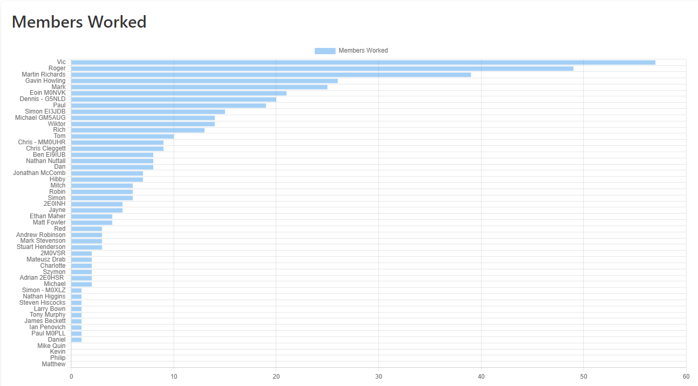
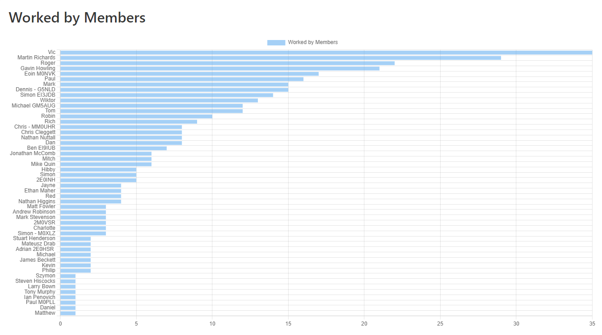

# Worked All OARC S2
## Retrospective

---

<!-- paginate: true -->
<!-- This is what we will cover, but its not an agenda as such -->
# What are we going to cover?

- What was Worked All OARC?
- How did we do as a community?
- How did you do as a participant?
- What did we learn?
- Next Season
<!-- Can have multiple on a slide -->

---

# WAOARC in a nutshell

We all came together again, over the summer, to see how many fellow community members we could work. The idea was get more of us on the air and communicating.

Today, I’d like to review what we did, identify what we can improve and generally discuss it.
<!-- Can also do a multiline
comment that will show in notes -->

---

# What was the goal of WAOARC?

> To work as many OARC members as you can during the Award period, to encourage some fun through radio operation, to promote OARC on the air and to reward exceptional feats and innovation during the contest.

---

# The Community

Any OARC member was eligible for WAOARC, there was no need to register or declare interest. If someone logged a QSO in the logger and they and the called station are an active member of the community, then you are part of WAOARC.

We will come onto the logger... but it was used to record the QSOs and crunch the numbers.

---

# Some numbers

Overall we had **51** members log QSOs into the logger, using **85** callsigns and we had **65** callsigns (probably less members) identified in QSOs but unclaimed.

So we probably had over **100** members participating, which from a population of just under **2000** members is about **5%** of our membership and an increase on last year (about **3%** of our membership at the time)

---

# Members Worked and being Worked by Members

 Vic - EI5IYB was the overall victor for members worked and being worked by the most members. Congratulations to him for not winning this non-contest ;-)

| Rank     | Member         | Worked   |
| -------- | -------------- | -------- |
| 1        | Vic - EI5IYB   | 57       |
| 2        | Roger - G6NWF  | 49       |
| 3        | Martin - G6FJI | 39       |
| 4        | Gavin - G5HOW  | 26       |
| 5        | Mark - 2M0IIG  | 25       |

| Rank     | Member         | Worked by |
| -------- | -------------- | --------- |
| 1        | Vic - EI5IYB   | 35        |
| 2        | Martin - G6FJI | 29        |
| 3        | Roger - G6NWF  | 22        |
| 4        | Gavin - G5HOW  | 21        |
| 5        | Eoin - M0NVK   | 17        |

---

---

---

# Counting Stats

For the counting stats nerds... we tracked a number of categories:

* QSOs made
* DXCC / ITUZ / CQZ contacted
* Bands and Modes used
* SOTA and POTA activations
* Gridsquares worked and activated

---

## QSOs made

As a community, we logged **1028** QSOs in total. Bearing in mind a QSO has two parties, we probably have about **700** unique QSOs but I lack the SQL to calculate the actual number simply. Contact me if you fancy the challenge!

[QSOs by Member](https://waoarc.oarc.uk/waoarc/usertable)

| Rank     | Member         | QSOs Made |
| -------- | -------------- | --------- |
| 1        | Vic - EI5IYB   | 180       |
| 2        | Martin - G6FJI | 108       |
| 3        | Gavin - G5HOW  | 99        |
| 4        | Dennis - G5NLD | 88        |
| 5        | Roger - G6NW   | 74        |

---

# Thanks for your time

This presentation is available  from https://smurphboy.github.io/WAOARC-S2-Slides/

<i class="fa-brands fa-twitter"></i> Twitter: [@smurphboy](https://twitter.com/smurphboy)
<i class="fa-brands fa-mastodon"></i> Mastodon: [@M0SMU](https://mastodon.radio/@M0SMU)
<i class="fa fa-window-maximize"></i> Blog: https://m7smu.org.uk
<i class="fa-brands fa-github"></i> GitHub: [smurphboy](https://github.com/smurphboy)

---

# <!--fit--> Large Text

---

<!-- Needed for mermaid, can be anywhere in file except frontmatter -->

# Mermaid

graph TD;
    A-->B;
    A-->C;
    B-->D;
    C-->D;

