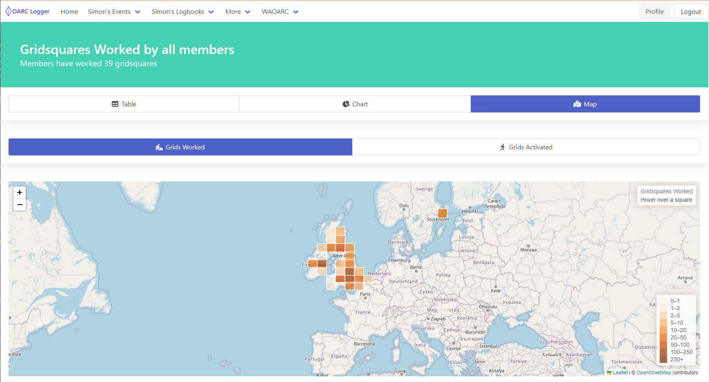

# Worked All OARC S2
## Retrospective

---

<!-- Speaker Notes -->
## Introduction

- What was Worked All OARC?
- How did we do as a community?
- How did you do as a participant?
- What did we learn?
- Next Season
<!-- Can have multiple on a slide -->

---

# **WAOARC in a nutshell**
We all came together again, over the summer, to see how many fellow community members we could work. The idea was get more of us on the air and communicating. Today, I’d like to review what we did, identify what we can improve and generally discuss it.
<!-- Can also do a multiline
comment that will show in notes -->

---

## Slide 3

> This is a quote.

---

## Slide 4

| Column 1 | Column 2 |
| -------- | -------- |
| Item 1   | Item 2   |
| Item 3   | Item 4   |

---

## Slide 5

## Left

- 1
- 2

## Right

- 3
- 4

---

## Slide 6

<i class="fa-brands fa-twitter"></i> Twitter: 
<i class="fa-brands fa-mastodon"></i> Mastodon: 
<i class="fa-brands fa-linkedin"></i> LinkedIn: 
<i class="fa fa-window-maximize"></i> Blog: 
<i class="fa-brands fa-github"></i> GitHub: 

---

# <!--fit--> Large Text

---

<!-- Needed for mermaid, can be anywhere in file except frontmatter -->

# Mermaid

graph TD;
    A-->B;
    A-->C;
    B-->D;
    C-->D;

